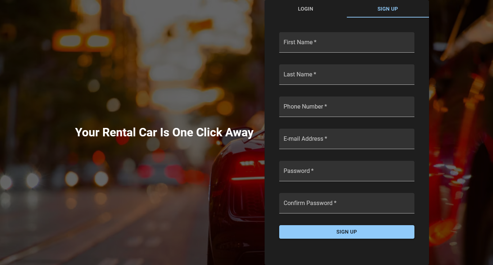
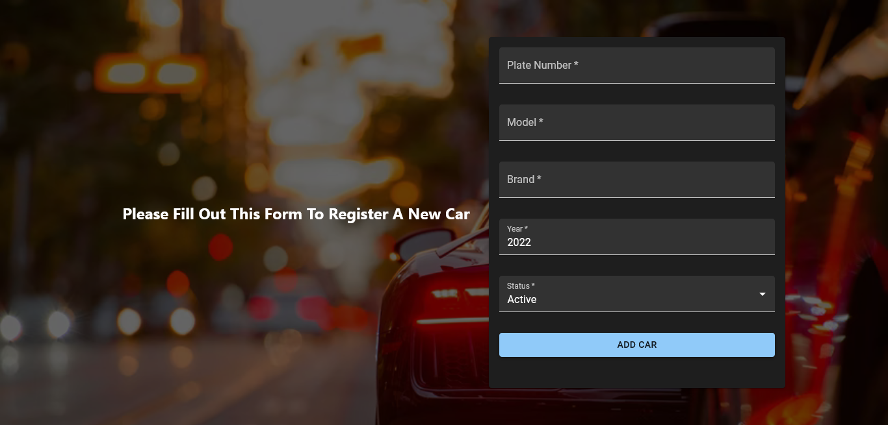
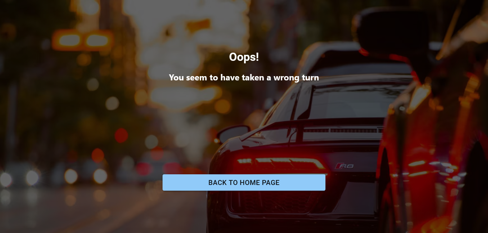
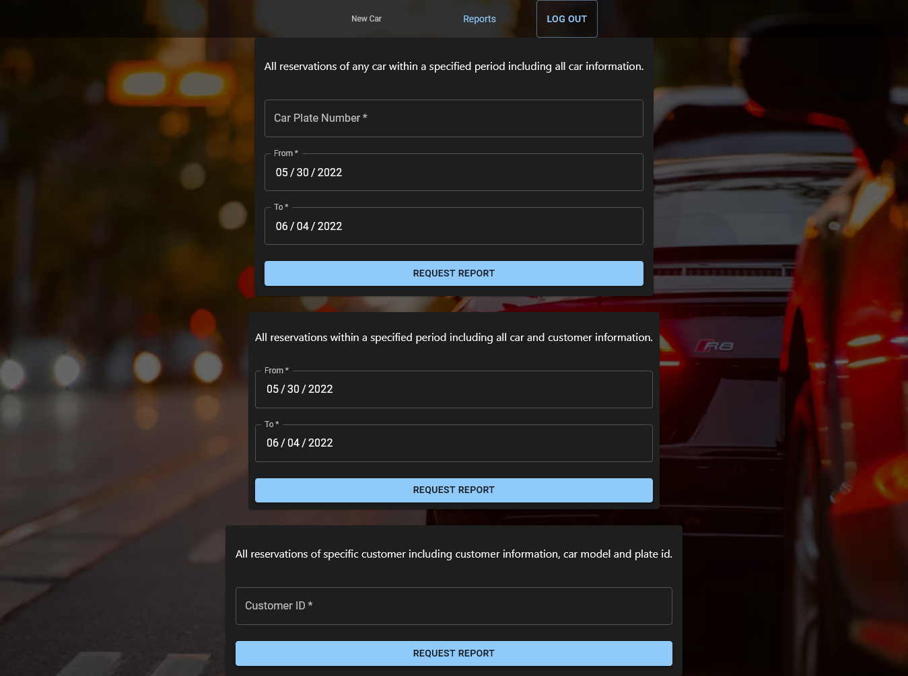
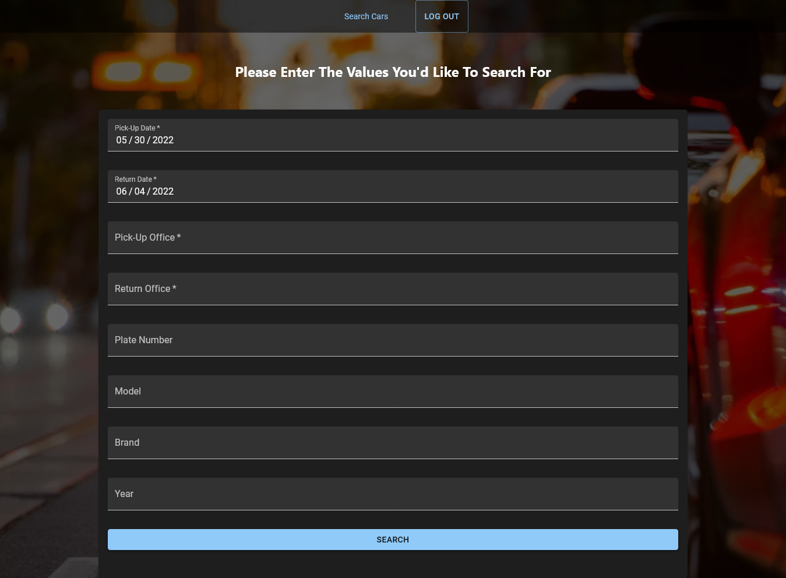

# Car Rental System

## Authors

```
Name:   Fatema Moharam
ID  :   6655

Name:   Abdelwahab
ID  :   5081

NAme:   Nada
ID  :        
```

## Project Structure

```
car-rental-system (root)
|_ server-side (PHP)
|   |_ data-creation.ddl
|   |_ data-management
|       |_ ...
|_ client-side (React.Js)
    |_ public
    |_ src
        |_ App
        |_ index
        |_ img
        |_ components
            |_ Home
            |_ Login
            |_ NotFound
            |_ Signup
            | ...
```
## instructions

### Setup (For the first time or after updates)
- You need to have `node.js` or `yarn` installed on your machine.
- Run `npm install` or `yarn install` in the root folder (from cmd) to download node modules.
- Place the contents of the folder `server-side` inside the directory of `XAMPP\htdocs\carrental`.

### running the app
- Run XAMPP.
- Run `npm start` in the `client-side` folder (from cmd).

### Note
You need to have a working internet connection to view the styling correctly (some fonts and the background picture are stored online).

## Screenshots

### Login/Signup pages


the user enters the email and password, and after validitychecks are performed in the front end, the data is sent using fetch API to the server which checks for the entered email ad password, customer Id is sent as a response as well as a boolean that indicates whether this user is an admin.

The front end page then transfers to the corresponding homepage and stores the received data in browser `sessionStorage`.


the user enters the required data,and after validity checks are performed in the front end, the data is sent using fetch API to the server which checks for any duplicate keys (e-mail, phone number, ...) and saves the user in the database if no duplicate keys are found.

### New Car Registration



This page only appears if the user is an admin. 

The admin enters the required data,and after validity checks are performed in the front end, the data is sent using fetch API to the server which checks for any duplicate keys (plate number) and saves the car in the database if no duplicate keys are found.

### Not Found Page



this page appears in case a wrong url is entered, or if the requested page needs admin access and the current user is not an admin.

### Reports Page



### Car Search Page



## roles:

### Fatema:

- Schema
- Front end

### Nada:

- Queries
- Back end

### Abdelwahab:

- ERD
- Schema
- Back end
